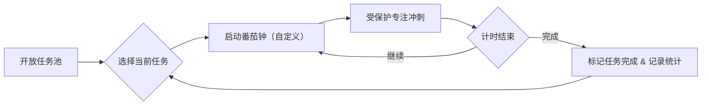

<div align="center">

# Todo Time Square ⏰✅

[](https://flutter.dev)  
[](LICENSE)  

**自由选择 · 专注执行**

</div>

<div align="center">
这是为偏好灵活与开放认知风格（MBTI 中的 P 型）量身打造的生产力工具：

“将无强制顺序的开放式任务池与定制番茄钟深度结合，支持即时选择单一任务并进入受保护的心流冲刺。”

</div>


<div align="center">

## 应用理念

</div>

<div align="center">
通过把宏观计划拆解为“可随时执行”的微观单元，我们把决策成本降到最低：用户无需提前把一天计划填满，而是从开放任务池中随心挑选，立刻启动番茄钟，进入 25 分钟（可定制）专注冲刺。每次冲刺后给予即时反馈与统计，任务可自动完成或继续下一轮。
</div>


<div align="center">
    
## 核心功能速览

</div>

- **开放任务池**：无强制顺序、支持随时增删、零负担浏览与挑选。  
- **一键番茄冲刺**：从任务池选择单个任务并启动专注计时（默认 25/5，可定制）。  
- **专注保护区**：最小化干扰、可锁定状态、即时可视化进度。  
- **冲刺后回馈**：任务自动标记，统计专注时长与完成次数。  
- **跨平台 Flutter 实现**：支持桌面与移动平台，界面现代且响应迅速。


<div align="center">
    
## 工作循环（可视化）

</div>




<div align="center">
    
## 仪表盘展示（示例）

</div>

<div align="center">

专注趋势（过去 7 天）

</div>

```
专注时长 (小时)
Mon ▉▉▉▉ 3.5
Tue ▉▉▉▉▉ 4.0
Wed ▉▉▉ 2.0
Thu ▉▉▉▉▉▉ 5.5
Fri ▉▉▉ 2.5
Sat ▉▉▉▉ 3.8
Sun ▉▉▉▉ 4.2
```

<div align="center">
任务完成率 vs 选择自由度
</div>

| 指标 | 说明 | 示例 |
|---:|---|:---:|
| 完成率 | 完成的任务 / 启动的任务 | 78% |
| 平均单次专注 | 单轮平均分钟数 | 25m |
| 连续冲刺率 | 同任务多轮比率 | 42% |


<div align="center">
    
## 为什么这套设计有效？

</div>

- **降低决策门槛**：把“今天该做什么”这种高成本问题，转化为“现在就做一件事”的低成本操作。  
- **把分散注意力变成重复短冲刺**：P 型人格的灵活性转为探索动力，再通过受保护冲刺把探索转成产出。  
- **即时反馈强化动机**：每次番茄钟后的统计和视觉回馈，会让正向循环持续建立。

<div align="center">
    
## 快速开始

</div>

- 克隆仓库并进入目录：

```powershell
git clone https://github.com/ChenXu233/ToDoTimeSquare.git; cd ToDoTimeSquare
```

- 安装依赖并生成本地化文件：

```powershell
flutter pub get; flutter gen-l10n
```

- 运行（开发模式）：

```powershell
flutter run
```

（指定平台示例：`flutter run -d windows`）


<div align="center">
    
## 项目结构速览

</div>

- `lib/`：应用入口与主要模块（`main.dart`、`screens/`、`providers/`、`widgets/`）。  
- `assets/`：图像、音效与本地资源。  
- `l10n/` & `i18n/`：多语言资源与生成配置。  


<div align="center">
    
## 贡献与联系

</div>

- 欢迎通过 Issue 或 Pull Request 提交建议与补丁。  
- 如需帮助或讨论产品设计，打开一个 Issue 或在 PR 中 @ChenXu233。


<div align="center">
    
## 许可证

</div>

本仓库使用 MIT 许可证，详见 `LICENSE` 文件。

<div align="center">
Made with ❤️ using Flutter
</div>
